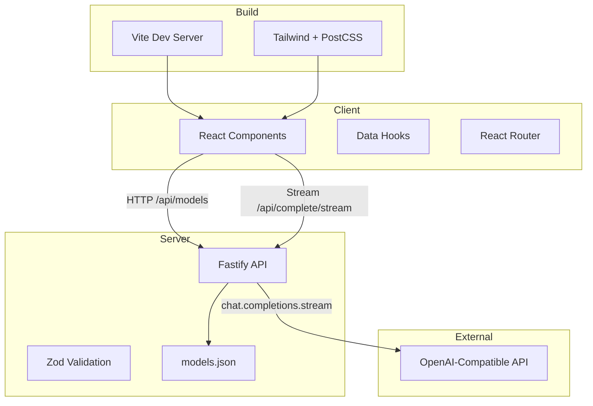
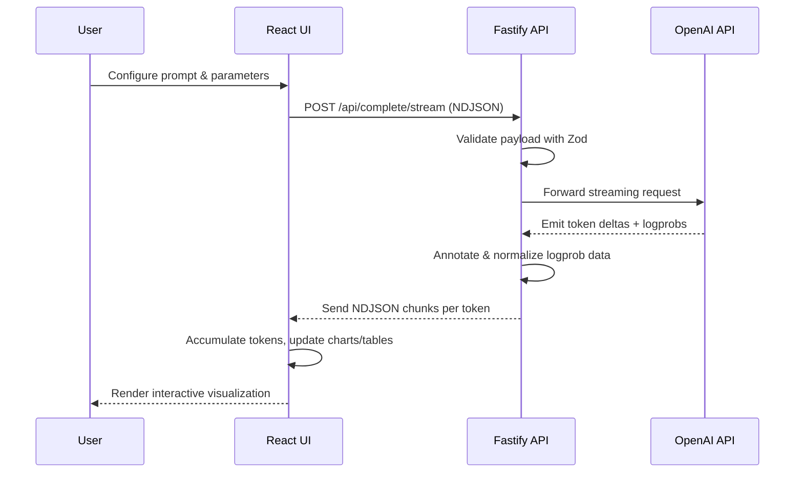

# Logprob Visualizer

An interactive Vite + React client paired with a Fastify streaming API for exploring token-level log probabilities from OpenAI-compatible chat models. Use it to inspect how models score alternative completions, tune parameters, and compare model behaviors in real time.

## Prerequisites
- Node.js 20 (LTS) and npm 10
- `.env.local` containing `OPENAI_API_KEY` and optional overrides (`OPENAI_BASE_URL`, `PORT`, `HOST`)
- Docker Desktop (for containerized workflows)
- Azure CLI (`az`) for publishing to Azure Container Apps

## Repository Layout
- `src/` – React application code (components, hooks, pages, shared utilities)
- `server/` – Fastify backend (`index.ts`) plus `models.json` describing available models
- `public/` – Static assets bundled by Vite
- `docker/` – Container scripts and configuration
- `scripts/publish-azure.sh` – Azure Container Apps deployment helper
- `dist/` – Production build artifacts (generated)

## Architecture Overview


## Process Flow


## Getting Started
1. Copy `.env.local.example` to `.env.local` (create if absent) and set `OPENAI_API_KEY`; optionally override `OPENAI_BASE_URL`, `PORT`, or `HOST`.
2. Install dependencies: `npm install`
3. Run the stack:
   - `npm run dev` – Vite dev server on `http://localhost:5173`
   - `npm run server` – Fastify API on `http://localhost:8787`
   - `npm run dev:all` – Concurrent client + API with shared logging

## How It Works
- Client uses React Router for views, TanStack Query hooks for data fetching, and Tailwind tokens for theming.
- `/api/models` exposes selectable models from `server/models.json`; update this file to add providers or rename models.
- `/api/complete/stream` validates requests (Zod), forwards them to the OpenAI SDK, and streams NDJSON chunks with token text, probability, and top alternatives.
- UI accumulates streamed tokens, computes percent/odds deltas, and renders charts, tables, and textual overlays.

## Customizing the App
- UI primitives live in `src/components`; follow PascalCase filenames and import Tailwind classes via semantic tokens defined in `tailwind.config.ts`.
- Shared logic belongs in `src/hooks` and `src/lib`; prefer discriminated unions or branded types for state.
- Add routed views under `src/pages` and register them in `src/main.tsx`.
- Extend the API in `server/index.ts`; update Zod schemas and client-side request contracts together to preserve type safety.

## Testing & Quality Gates
- Type safety: `npm run typecheck`
- Static analysis & formatting: `npm run lint`, `npm run lint:fix`, `npm run pretty`
- Manual smoke: `npm run preview` (after `npm run build`) and hit `/api/health`
- When introducing automated tests, colocate `*.test.ts(x)` files near their modules and wire them into Vitest.

## Build & Deploy
- Production bundle: `npm run build` (or `npm run build:dev` for a debug bundle) – artifacts in `dist/`
- Local production preview: `npm run preview`

### Docker Workflow
1. `npm run docker:build` – builds `logprob-visualizer:demo`
2. Ensure `.env.local` contains runtime variables or pass them via `--env` flags
3. `npm run docker` – runs the container (maps port `8000` to the container’s `80` by default)

### Publish to Azure Container Apps
`npm run publish` invokes `scripts/publish-azure.sh`.

Required:
- `APP_NAME` – Container App name

Optional:
- `AZ_SUBSCRIPTION`, `RESOURCE_GROUP`, `ENVIRONMENT`, `LOCATION`, `INGRESS`, `TARGET_PORT`, `ENV_ARGS`

Example:
```bash
APP_NAME=my-logprob-viewer RESOURCE_GROUP=rg-llm ENVIRONMENT=aca-env \
LOCATION=eastus TARGET_PORT=8000 npm run publish
```
If `ENV_ARGS` is omitted, the script converts `.env.local` entries into `--env-vars` pairs automatically.

## Implementation Notes
- Logging: Fastify emits structured logs with request IDs derived from headers or generated UUIDs.
- Rate limiting and CORS are centralized in `server/index.ts`; modify them there to maintain consistent hardening.
- Streaming: The server writes NDJSON to keep latency low while the client progressively renders tokens.

## Troubleshooting
- `az account show` failing → run `az login` before publishing.
- 500 errors from `/api/complete/stream` → verify `OPENAI_API_KEY` and network reachability to the provider.
- Missing models in the UI → ensure each entry in `server/models.json` includes `id` and `name`.

## Contributing
Consult `AGENTS.md` for coding standards, branching strategy, and review expectations before opening a pull request.
